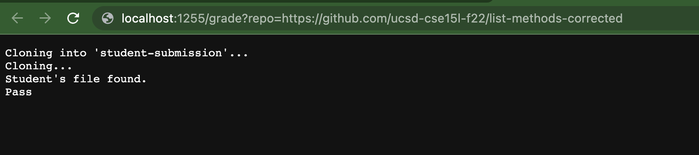
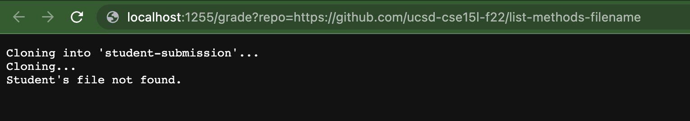
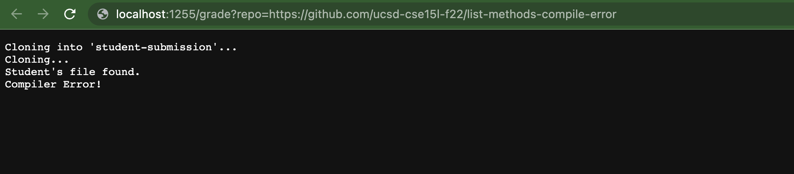
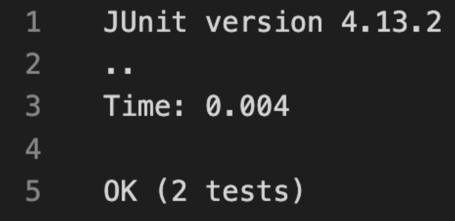

# LAB REPORT 5

### grade.sh

```# Create your grading script here

rm -rf student-submission
git clone $1 student-submission

echo "Cloning..."

cd student-submission

if [ -f ListExamples.java ]
then
    echo "Student's file found."

    echo "Student's file not found."
    exit
fi

cp ListExamples.java ..

cd ..

javac -cp .:lib/hamcrest-core-1.3.jar:lib/junit-4.13.2.jar *.java

if [ $? -ne 0 ]
then
    echo "Compiler Error!"
    exit
fi

java -cp .:lib/hamcrest-core-1.3.jar:lib/junit-4.13.2.jar org.junit.runner.JUnitCore TestListExamples
OK=$(grep -c OK grade.txt)

if [ $OK -eq 1 ]
then
    echo "Pass"
else
    echo "Fail"
fi

exit
```

Worked with Adarsh Patel










