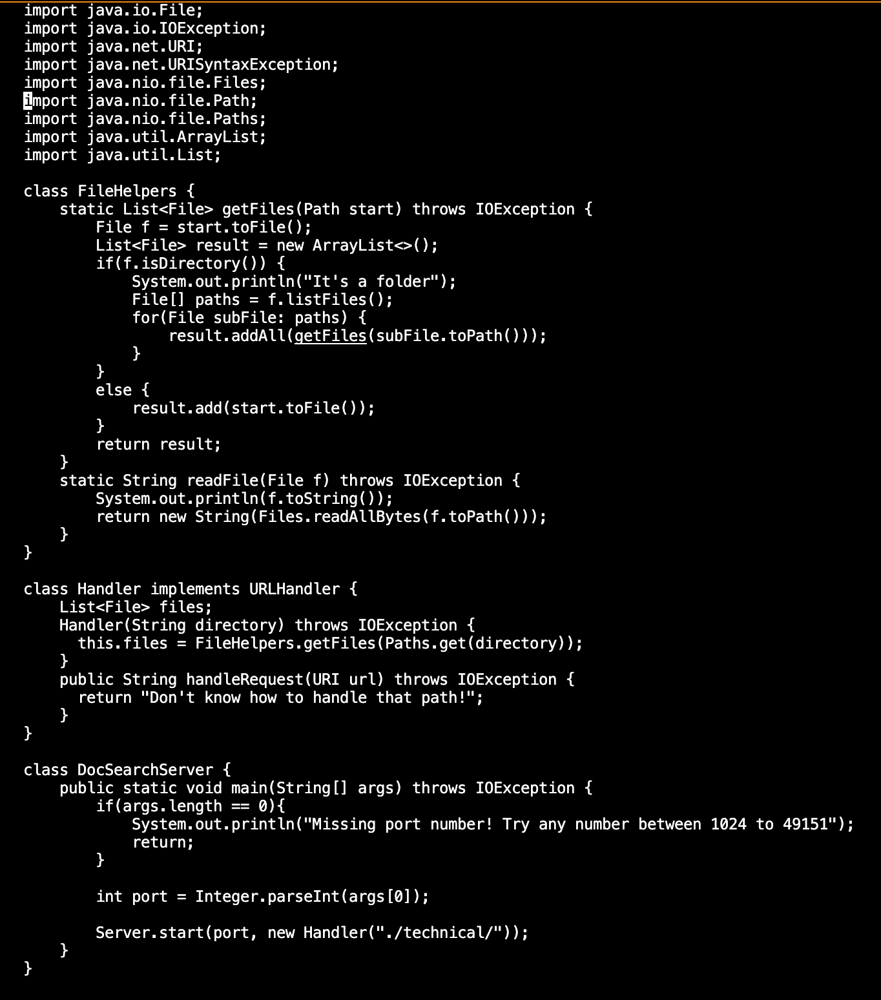
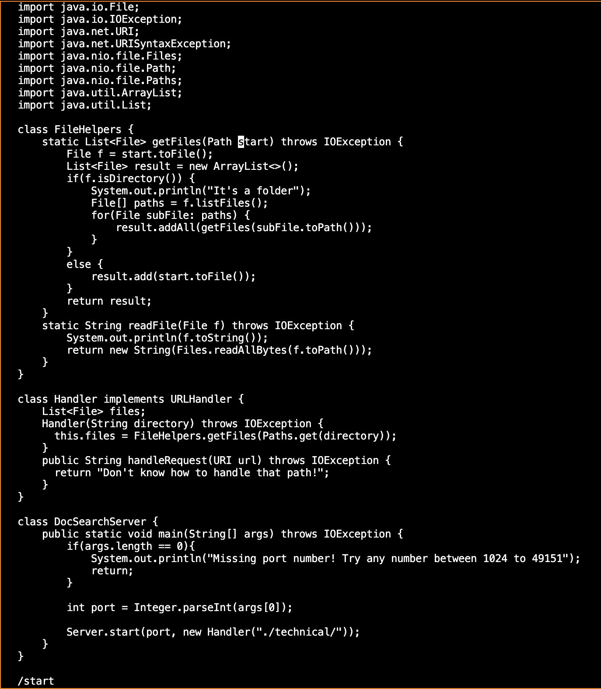
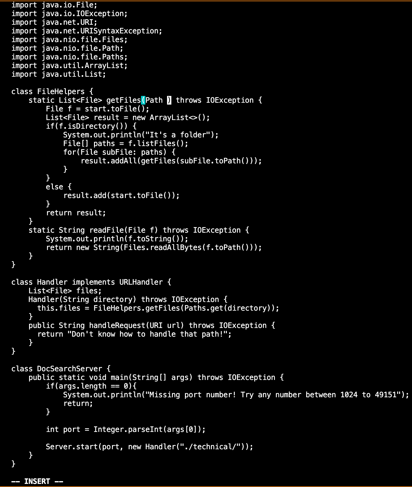
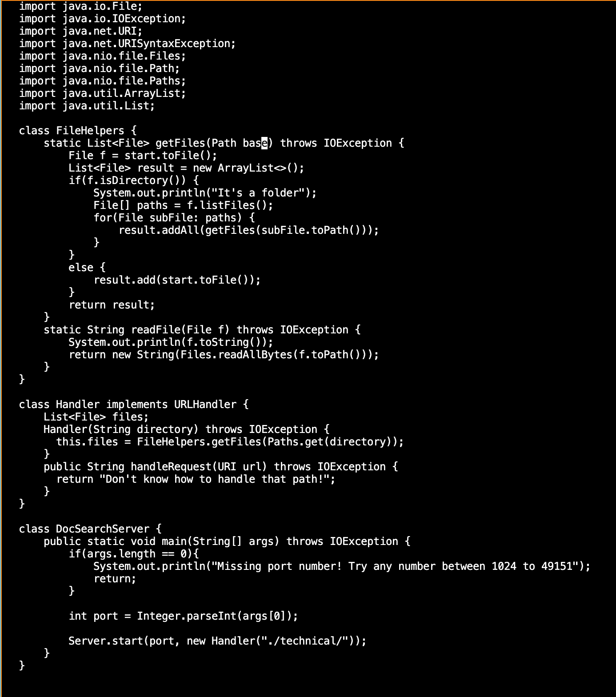
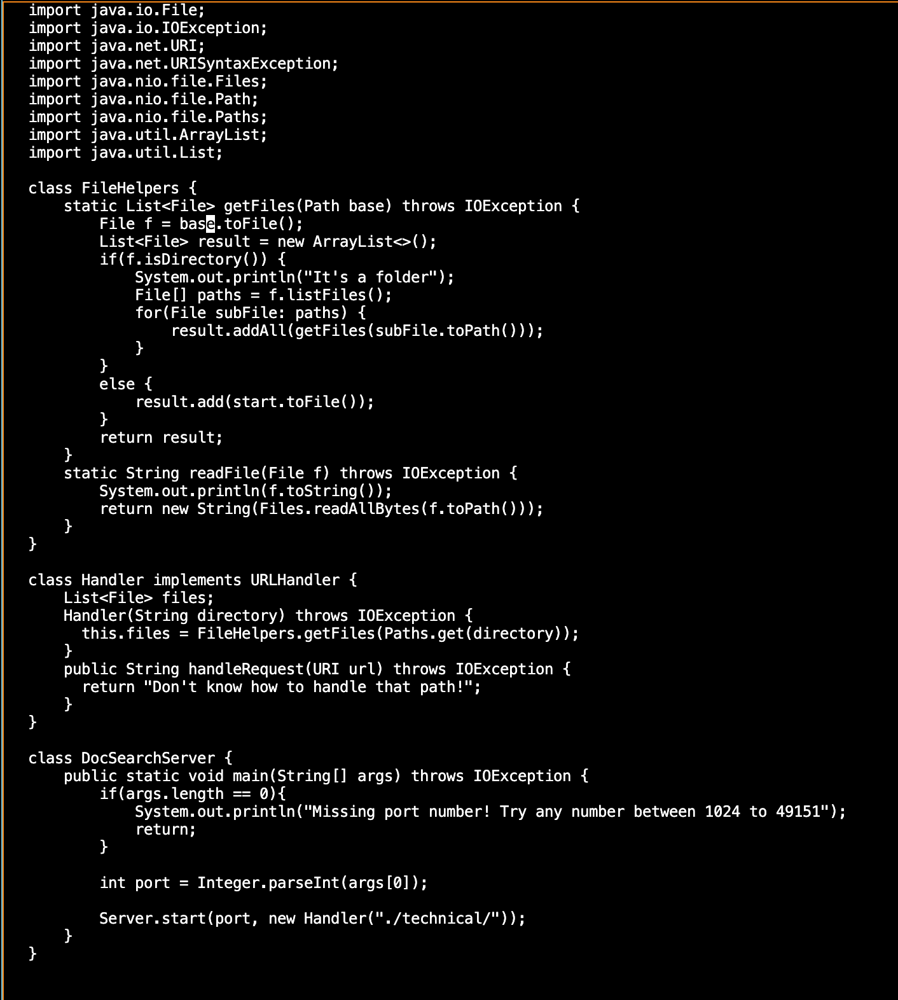
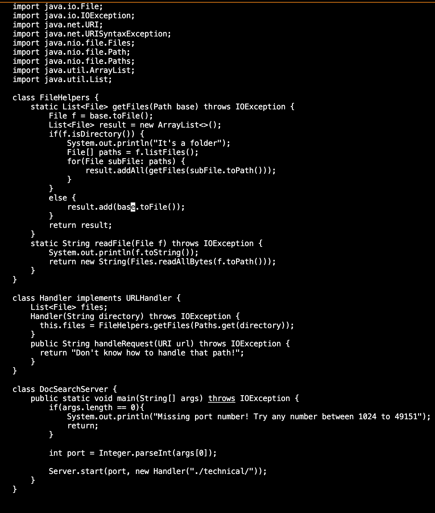
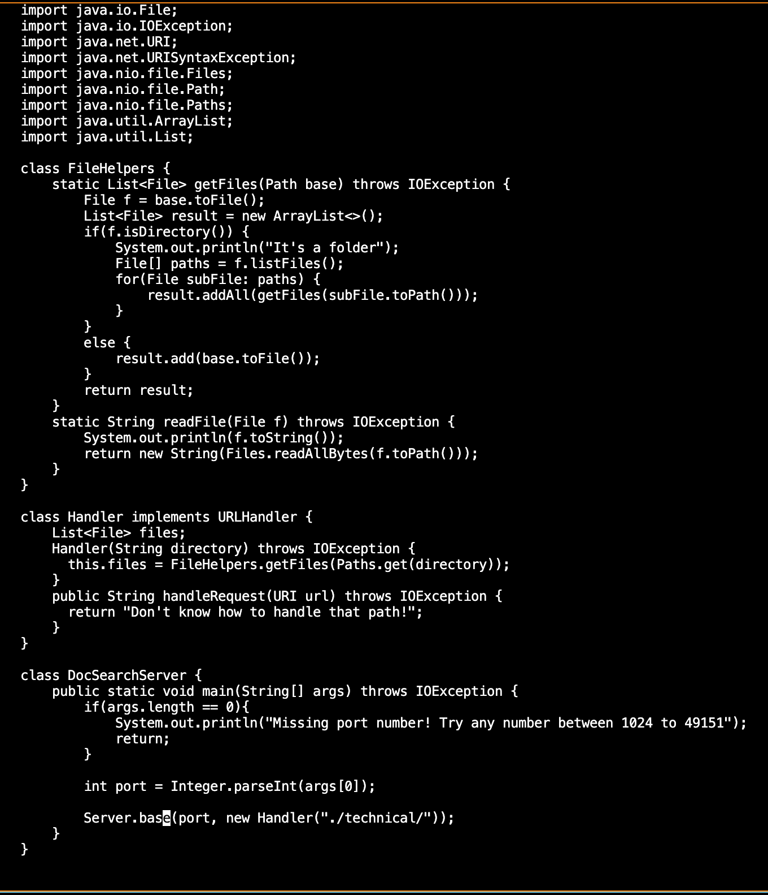
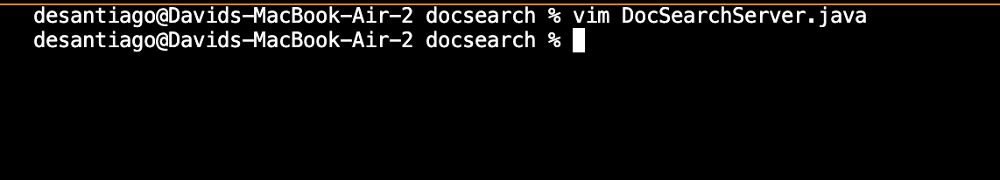

# LAB REPORT 4

### PART ONE

- Type: `vim DocSearchServer.java <Enter>` which directs you to the file``DocSearchServer file``. 

- Press: `/start <enter>`, searching for the word in the code and going to the first from top to bottom.

- Press: `cgn`, switches to insert mode over the word start, which means it will replace it.

- Press: `base <esc>`, replaces the word "start" with "base".

- Press: `n .`, goes to the next "start".
- Press: `cgn`, switches to insert mode over the word start, which means it will replace it.
- Press: `base <esc>`, replaces the word "start" with "base".

- Press: `n .`, repeats step 5.
- Press: `cgn`, switches to insert mode over the word start, which means it will replace it.
- Press: `base <esc>`, replaces the word "start" with "base".

- Press: `n .`, repeats step 5.
- Press: `cgn`, switches to insert mode over the word start, which means it will replace it.
- Press: `base <esc>`, replaces the word "start" with "base".

- Press: `:wq`, saving changes and quitting from vim.

### PART TWO
  
- With the scping into the file into the remote server, the process took 34 seconds, after getting stuck on running the commands, but
  besides that, it was a quick and simple process.
- With the ssh and editing through vim, the process did take longer because you had to manually make the changes to have it work and joining and exiting vim. The process did take around 47 seconds.
  
*Thoughts* 
  - Personally I believe the scp style is a lot more quicker and efficient becuase of the amount of time you save and little steps it requires, but 
  I feel more comfortable using vim than scp even though the process does take longer.
  
  - Just preference influenced me to make my decision one way, it wasn't really as much the project/task factoring in. 

